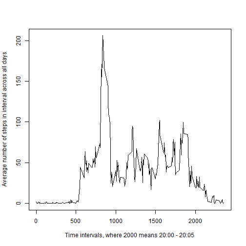
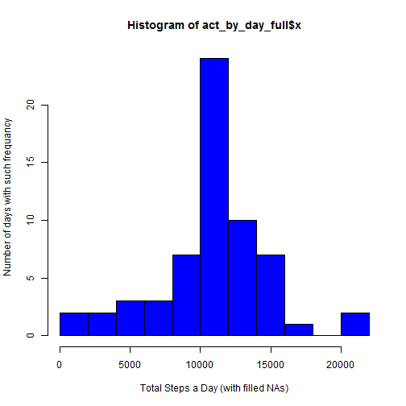
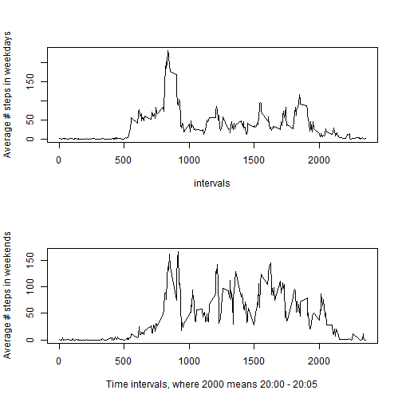

# Reproducible Research: Peer Assessment 1


## Loading and preprocessing the data
Let's call the variable "activity". "activity_clear" contains no NAs.

```r
activity = read.csv("activity.csv")
activity_clear = subset(activity, !is.na(activity$steps))
```

## What is mean total number of steps taken per day?
Mean is low, but non-zero, while median is exactly zero. Most days have no activity at all.

```r
hist(x = activity_clear$steps, col="blue", 
     xlab="Total Steps a Day (with cleared NAs)", 
     ylab="Number of days with such frequancy")
```

 

```r
mean(activity_clear$steps)
```

```
## [1] 37.38
```

```r
median(activity_clear$steps)
```

```
## [1] 0
```

## What is the average daily activity pattern?
The most activity is observed aroun 8:35 a.m.

```r
intervals = unique(activity_clear$interval)
av_act = c()
for (i in 1:length(intervals)){
    interval_values = subset(activity_clear, activity_clear$interval == intervals[i])
    av_int = mean(interval_values$steps)
    av_act = c(av_act, av_int)
    }

plot(x = intervals, y = av_act, type="l", 
     ylab="Average number of steps in interval across all days", 
     xlab="Time intervals, where 2000 means 20:00 - 20:05")
```

 

```r
maxint = which.max(av_act)
intervals[maxint]
```

```
## [1] 835
```

```r
av_act[maxint]
```

```
## [1] 206.2
```

## Imputing missing values
Replacing NAs with the average value for the time interval. No changed in averages observed.

```r
number_of_missings = sum(is.na(activity$steps))


activity_full = activity
for (i in 1:length(activity_full$steps)){
    if (is.na(activity_full$steps[i])){
        interval_number = which(intervals == activity_full$interval[i])
        activity_full$steps[i] = av_act[interval_number]
        }
    }

hist(x = activity_full$steps, col="blue", xlab="Total Steps a Day (with filled NAs)",
     ylab="Number of days with such frequancy")
```

 

```r
mean(activity_full$steps)
```

```
## [1] 37.38
```

```r
median(activity_full$steps)
```

```
## [1] 0
```


## Are there differences in activity patterns between weekdays and weekends?
Weekdays have top activity in the morning and the second top in the evening, which probably corresponds to time before and after work/school/college.

On the other hand, in weekends activity time has higher varience, with tops spread all over the day, starting at 8 a.m. and with other tops at 9, 12-14, 16, etc. Though tops become lower towards the evening.

```r
activity_full$weekday = weekdays(as.Date(activity_full$date))
activity_full$weekday = as.factor(activity_full$weekday)
for (i in 1:length(activity_full$steps)){
    if (activity_full$weekday[i] == "воскресенье" | activity_full$weekday[i] == "суббота"){
        activity_full$weekday_type[i] = "Weekend"
        }
    else{
        activity_full$weekday_type[i] = "Weekday"
        }
    }
activity_full$weekday_type = as.factor(activity_full$weekday_type)
activity_full$weekday = NULL

weekdays_act = subset(activity_full, activity_full$weekday_type == "Weekday")
weekend_act = subset(activity_full, activity_full$weekday_type == "Weekend")

av_wday_act = c()
av_wend_act = c()
for (i in 1:length(intervals)){
    
    interval_values = subset(weekdays_act, weekdays_act$interval == intervals[i])
    av_int1 = mean(interval_values$steps)
    av_wday_act = c(av_wday_act, av_int1)
    
    interval_values = subset(weekend_act, weekend_act$interval == intervals[i])
    av_int2 = mean(interval_values$steps)
    av_wend_act = c(av_wend_act, av_int2)
    }


par(mfrow=c(2,1))
plot(x = intervals, y = av_wday_act, type="l", ylab="Average # steps in weekdays")
plot(x = intervals, y = av_wend_act, type="l", ylab="Average # steps in weekends",
     xlab="Time intervals, where 2000 means 20:00 - 20:05")
```

 

